# Research Question

Check if there are region-specific differences in the Forced Vital Capacity (FVC)
and the Forced Expiratory Volume in 1 second (FEV1).

# Loading Data

The data fields:

* age, the age in years,
* height, the height in cm,
* weight, the weight in kg,
* FVC, Forced Vital Capacity, the volume of air that can forcibly be blown out, after full inspiration, measured in centiliter,
* FEV1, Forced Expiratory Volume in 1 second, the volume of air that can forcibly be blown out in first 1 second, after full inspiration, measured, in centiliter,
* region, M - Murau (plenty of woods, no industries), A - Aichfeld (lots of industries).


```r
setwd("D:/Home.Dima/OneDrive/MASNA/github_masna/Generalized Linear Models/")
data  <- read_excel("Spirometry.xlsx", sheet = "Tabelle1")
```

```
## readxl works best with a newer version of the tibble package.
## You currently have tibble v1.4.2.
## Falling back to column name repair from tibble <= v1.4.2.
## Message displays once per session.
```

```r
# factorization of the region field
data$region <- factor(data$region, levels = c('A', 'M'), labels = c('A', 'M'))
```

# Explanatory Data Analysis


```r
# Summary of the non-caterogical inputs
summary(data[, c('region', 'age', 'height', 'weight', 'FVC', 'FEV1')])
```

```
##  region      age            height          weight            FVC       
##  A:34   Min.   :16.00   Min.   :160.0   Min.   : 54.00   Min.   :395.0  
##  M:45   1st Qu.:20.00   1st Qu.:172.0   1st Qu.: 70.00   1st Qu.:495.0  
##         Median :31.00   Median :176.0   Median : 78.00   Median :550.0  
##         Mean   :30.28   Mean   :176.9   Mean   : 77.33   Mean   :553.5  
##         3rd Qu.:37.50   3rd Qu.:181.5   3rd Qu.: 85.00   3rd Qu.:602.5  
##         Max.   :56.00   Max.   :195.0   Max.   :102.00   Max.   :780.0  
##       FEV1      
##  Min.   :330.0  
##  1st Qu.:412.5  
##  Median :460.0  
##  Mean   :459.7  
##  3rd Qu.:502.5  
##  Max.   :635.0
```

Building the pairwise comparision matrix which can help to understand how the
variables are distributed and how they interact with each other. All data in the
plot is 'groupped' by the region.


```r
p <- ggpairs(data, columns = c('region', 'age', 'height', 'weight', 'FVC', 'FEV1'),
        mapping = aes(color = region), legend = 1,
        upper = list(continuous = wrap("cor", size = 3)),
        diag  = list(continuous = wrap("densityDiag", alpha=0.4)),
        lower = list(continuous = wrap("smooth", alpha = 0.5, size=0.3))) +
  theme(legend.position = "bottom")

p
```

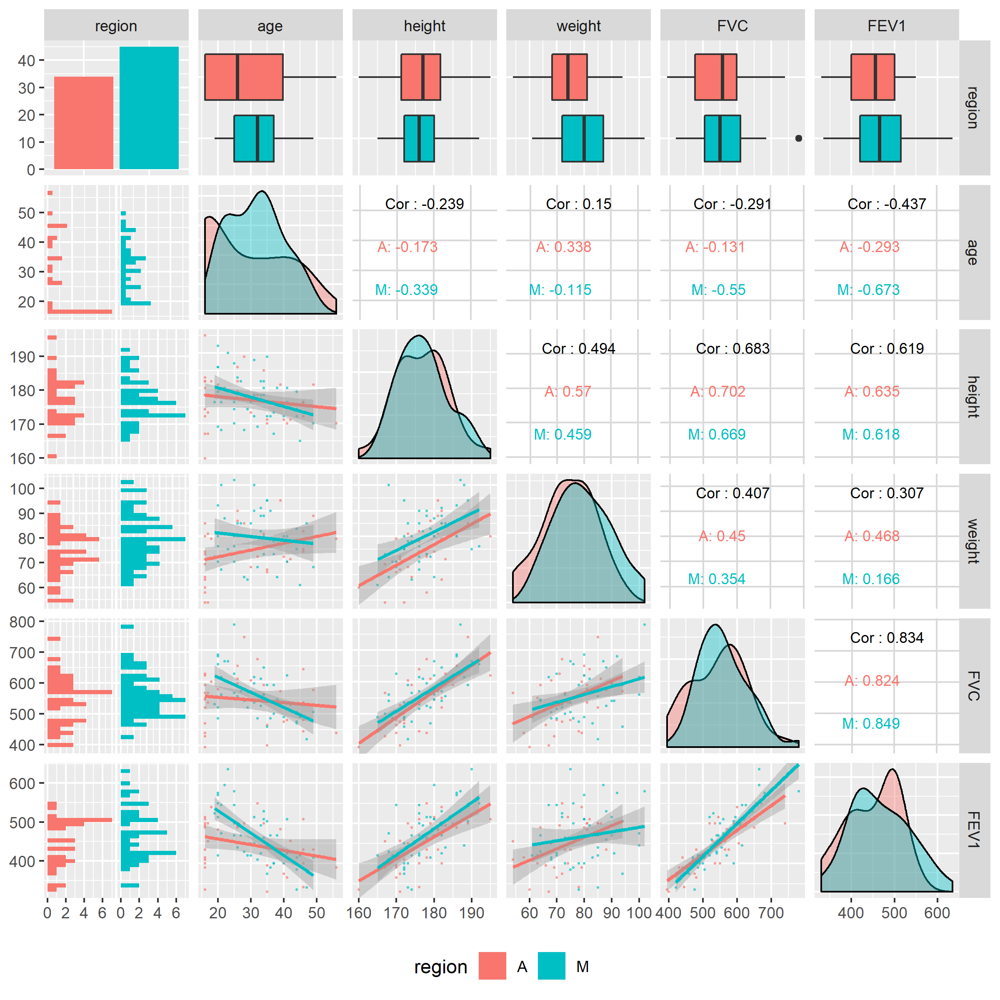

The number of respondents are more or less even between the regions. The respondents are of different ages, height and weight from the regions so we can't directly compare the estimaties of FVC, FEV1 between the regions without taking the difference into account.

It's interesting to note few things

- the 'age' input is not distributed normally, there are more young people,
- the 'height', 'weight' inputs are not of a strong linear correlation, they are probably both required for the model,
- there is a strong linear correlation between FVC and FEV1, so either of them will be a good candidate for the outcome variable,
- FVC is the right-skewed, FEV1 is of a bi-modal distribution; FVC may be a better response variable then as it can be easier linearized.

Let's look closer at the relations of age, height and weight with FEV1, FVC because we are going to consider the linear regression based on that. Plotting the covariates against FEV1 and FVC.


```r
gs <-list(NA,NA,NA,NA,NA,NA)

i <- 1
for (rv in c('FEV1', 'FVC')) {
  for (pv in c('age', 'height', 'weight')) {
    g <- ggplot(data = data, aes_string(x = pv, y = rv), alpha = 0.7) +
      geom_point(aes(color = region)) +
      geom_smooth(method = 'lm', formula = y ~ x, color = 'green', se = FALSE) +
      geom_smooth()
    gs[[i]] <- g
    i <- i + 1
  }
}

pm <- ggmatrix(
  gs, nrow = 2, ncol = 3,
  xAxisLabels = c('age', 'height', 'weight'),
  yAxisLabels = c('FVC', 'FEV1'),
  title = "Pairwise Comparison of Predictors and Responses"
  )

pm
```

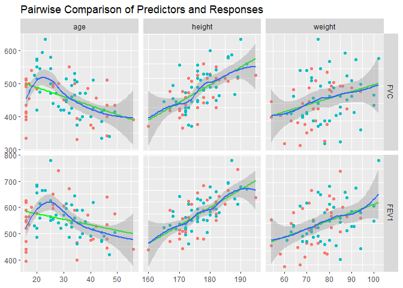<!-- -->

The relationship between age and either of FVC, FEV1 is not linear due to inclusion of young people. The data suggests that FVC/FEV1 increases until some age around 25 and start decreasing after that.

Looking closer at the age distribution over the regions.


```r
ggplot(data, aes(x = age, y = region, color = region)) +
  geom_point() +
  geom_jitter()
```

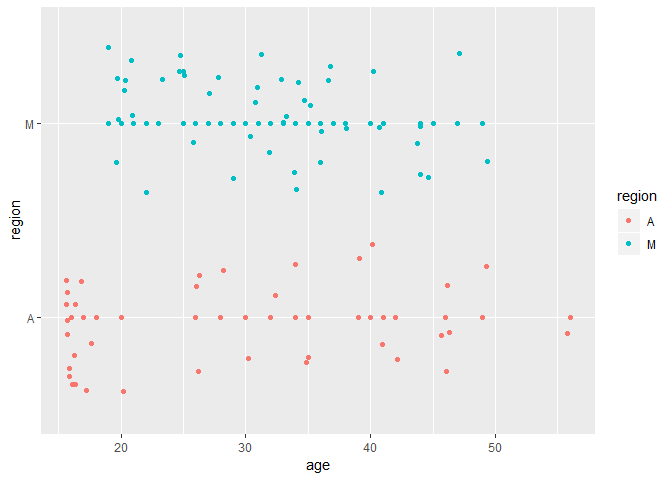<!-- -->

There is a considerable number of observations (n = 11) with the age less than 17 for the 'A' region.


```r
data[, c('age', 'region')] %>% 
  count(age, region) %>% 
  spread(key = region, value = n, fill = '-') %>% 
  arrange(age) %>% 
  print(n = 100)
```

```
## # A tibble: 32 x 3
##      age A     M    
##    <dbl> <chr> <chr>
##  1    16 11    -    
##  2    17 2     -    
##  3    18 1     -    
##  4    19 -     1    
##  5    20 1     5    
##  6    21 -     2    
##  7    22 -     1    
##  8    23 -     1    
##  9    25 -     4    
## 10    26 3     1    
## 11    27 -     1    
## 12    28 1     1    
## 13    29 -     1    
## 14    30 1     1    
## 15    31 -     3    
## 16    32 1     1    
## 17    33 -     3    
## 18    34 1     3    
## 19    35 2     2    
## 20    36 -     2    
## 21    37 -     2    
## 22    38 -     1    
## 23    39 1     -    
## 24    40 1     1    
## 25    41 1     2    
## 26    42 1     -    
## 27    44 -     3    
## 28    45 -     1    
## 29    46 4     -    
## 30    47 -     1    
## 31    49 1     1    
## 32    56 1     -
```

It can be an indicator of some error during the sampling. We should probably remove this subset of observations to make the data be more suitable for the linear regression. In doing that, we create another dataset for the age more than 16.


```r
data2 <- data %>% filter(age > 16)
```

Checking the relationship between the variables.


```r
gs <-list(NA,NA,NA,NA,NA,NA)

i <- 1
for (rv in c('FEV1', 'FVC')) {
  for (pv in c('age', 'height', 'weight')) {
    g <- ggplot(data = data2, aes_string(x = pv, y = rv), alpha = 0.7) +
      geom_point(aes(color = region)) +
      geom_smooth(method = 'lm', formula = y ~ x, color = 'green', se = FALSE) +
      geom_smooth(method = 'loess')
    gs[[i]] <- g
    i <- i + 1
  }
}

pm <- ggmatrix(
  gs, nrow = 2, ncol = 3,
  xAxisLabels = c('age', 'height', 'weight'),
  yAxisLabels = c('FVC', 'FEV1'),
  title = "Pairwise Comparison of Predictors and Responses"
  )

pm
```

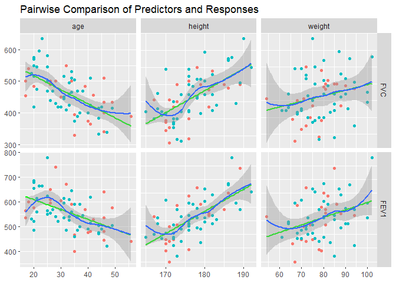<!-- -->

That' better now for the age variable (against FVC/FEV1) but it has got worse for the height one. Let's check what is the relation between the height and weight.


```r
data2['weight2'] <- sqrt(data2['weight'])

ggplot(data2, aes(x = height, y = weight)) +
  geom_smooth(method = 'lm', formula = y ~ x, color = 'green', se = FALSE) +
  geom_smooth(formula = y ~ x) +
  geom_point(aes(color = region)) +
  geom_jitter(aes(color = region))
```

```
## `geom_smooth()` using method = 'loess' and formula 'y ~ x'
```

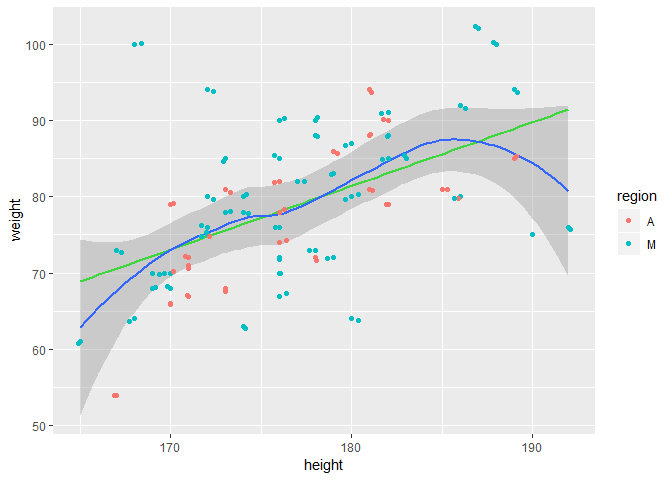<!-- -->


# Linear Regression

## Tests for LM Assumptions

**Linear relationship**. The relationship between age and either of FVC, FEV1 is not linear. For the other two covariates, it is more or less linear. As in the age, the data suggests that FEV1 increases until some age around 25 and start decreasing after that.

**Normality**. The age is not normally distributed. The Shapiro-Wilk normality test rejects the null hypothesis at the level p<0.003 for the whole dataset and it does not reject it for the reduced dataset (with the age more than 16).


```r
shapiro.test(data$age)
```

```
## 
## 	Shapiro-Wilk normality test
## 
## data:  data$age
## W = 0.94755, p-value = 0.002701
```

```r
shapiro.test(data2$age)
```

```
## 
## 	Shapiro-Wilk normality test
## 
## data:  data2$age
## W = 0.96976, p-value = 0.09712
```

**Variance**. On the pairwise scatterplots each covariate has values around the regression line more or less evently.

**Multicollinearity** The Pearson's correlation coeffiecient is not large for the pairs of the covariates. We will also diagnose violation of this assumption later while analysing the linear regression models.

## Models


```r
lm_FVC_1 = lm(data = data2, formula = FVC ~ age+height+weight)
summary(lm_FVC_1)
```

```
## 
## Call:
## lm(formula = FVC ~ age + height + weight, data = data2)
## 
## Residuals:
##      Min       1Q   Median       3Q      Max 
## -109.800  -35.095   -7.793   32.651  127.550 
## 
## Coefficients:
##              Estimate Std. Error t value Pr(>|t|)    
## (Intercept) -560.3321   200.5761  -2.794 0.006868 ** 
## age           -2.5876     0.7016  -3.688 0.000468 ***
## height         6.6763     1.2290   5.432 9.22e-07 ***
## weight         0.2844     0.7501   0.379 0.705832    
## ---
## Signif. codes:  0 '***' 0.001 '**' 0.01 '*' 0.05 '.' 0.1 ' ' 1
## 
## Residual standard error: 51.04 on 64 degrees of freedom
## Multiple R-squared:  0.5609,	Adjusted R-squared:  0.5403 
## F-statistic: 27.25 on 3 and 64 DF,  p-value: 1.788e-11
```

```r
sprintf('AIC=%.1f', AIC(lm_FVC_1))
```

```
## [1] "AIC=733.7"
```

All predictors are significant except weight. That's interesting because one might expect that the volume and strength of lungs depend on both the height and the weight of a person. Let's check the model without the weight.


```r
lm_FVC_2 = lm(data = data2, formula = FVC ~ age+height)
summary(lm_FVC_2)
```

```
## 
## Call:
## lm(formula = FVC ~ age + height, data = data2)
## 
## Residuals:
##     Min      1Q  Median      3Q     Max 
## -111.75  -35.07   -9.28   31.59  131.84 
## 
## Coefficients:
##              Estimate Std. Error t value Pr(>|t|)    
## (Intercept) -583.8973   189.4431  -3.082 0.003013 ** 
## age           -2.5524     0.6908  -3.695 0.000454 ***
## height         6.9297     1.0245   6.764 4.52e-09 ***
## ---
## Signif. codes:  0 '***' 0.001 '**' 0.01 '*' 0.05 '.' 0.1 ' ' 1
## 
## Residual standard error: 50.7 on 65 degrees of freedom
## Multiple R-squared:  0.5599,	Adjusted R-squared:  0.5463 
## F-statistic: 41.34 on 2 and 65 DF,  p-value: 2.605e-12
```

```r
sprintf('AIC=%.1f', AIC(lm_FVC_2))
```

```
## [1] "AIC=731.8"
```


```r
lm_FEV1_1 = lm(data = data2, formula = FEV1 ~ age + height + weight)
summary(lm_FEV1_1)
```

```
## 
## Call:
## lm(formula = FEV1 ~ age + height + weight, data = data2)
## 
## Residuals:
##     Min      1Q  Median      3Q     Max 
## -97.313 -34.444  -2.419  29.250  98.233 
## 
## Coefficients:
##              Estimate Std. Error t value Pr(>|t|)    
## (Intercept) -313.6539   174.4253  -1.798   0.0769 .  
## age           -3.3562     0.6101  -5.501 7.08e-07 ***
## height         5.1321     1.0688   4.802 9.84e-06 ***
## weight        -0.2859     0.6523  -0.438   0.6627    
## ---
## Signif. codes:  0 '***' 0.001 '**' 0.01 '*' 0.05 '.' 0.1 ' ' 1
## 
## Residual standard error: 44.38 on 64 degrees of freedom
## Multiple R-squared:  0.5801,	Adjusted R-squared:  0.5605 
## F-statistic: 29.48 on 3 and 64 DF,  p-value: 4.324e-12
```

```r
sprintf('AIC=%.1f', AIC(lm_FEV1_1))
```

```
## [1] "AIC=714.7"
```


```r
lm_FEV1_2 = lm(data = data2, formula = FEV1 ~ age + height)
summary(lm_FEV1_2)
```

```
## 
## Call:
## lm(formula = FEV1 ~ age + height, data = data2)
## 
## Residuals:
##    Min     1Q Median     3Q    Max 
## -95.35 -33.82  -1.15  27.62  97.57 
## 
## Coefficients:
##              Estimate Std. Error t value Pr(>|t|)    
## (Intercept) -289.9663   164.8060  -1.759   0.0832 .  
## age           -3.3916     0.6010  -5.643 3.93e-07 ***
## height         4.8773     0.8913   5.472 7.63e-07 ***
## ---
## Signif. codes:  0 '***' 0.001 '**' 0.01 '*' 0.05 '.' 0.1 ' ' 1
## 
## Residual standard error: 44.11 on 65 degrees of freedom
## Multiple R-squared:  0.5789,	Adjusted R-squared:  0.5659 
## F-statistic: 44.67 on 2 and 65 DF,  p-value: 6.212e-13
```

```r
sprintf('AIC=%.1f', AIC(lm_FEV1_2))
```

```
## [1] "AIC=712.9"
```

Let's choose the model FVC ~ age + height because it has comparable R-squared and AIC with much more statistically significant intercept. Though there can 


```r
lm <- lm_FVC_2
autoplot(lm, which = 1:6, ncol = 3, label.size = 3, 
         title = sprintf('Diagnostic Plots for %s', as.character(formula(lm))))
```

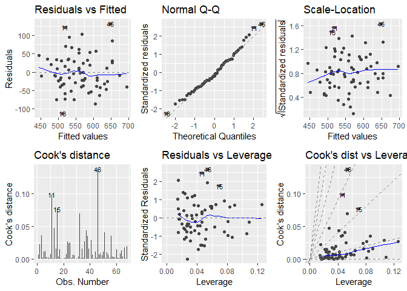<!-- -->


```r
lm <- lm_FEV1_2
autoplot(lm, which = 1:6, ncol = 3, label.size = 3, 
         title = sprintf('Diagnostic Plots for %s', as.character(formula(lm))))
```

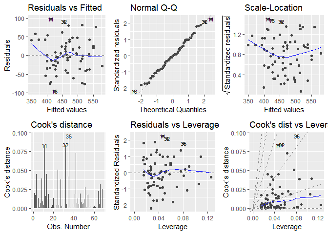<!-- -->

# Box-Cox Transformation


```r
par(mfrow=c(1,2))

bc_runs_1 <- boxcox(data = data2, FVC ~ age + height,  lambda = seq(-1, 2, 0.01))
bc1_lambda <- bc_runs_1$x[which.max(bc_runs_1$y)]
title(main = 'FVC ~ age + height',  sub = sprintf('max(lambda) = %.2f', bc1_lambda),
      cex.main = 1)

bc_runs_2 <- boxcox(data = data2, FEV1 ~ age + height, lambda = seq(-1, 2, 0.01))
bc2_lambda <- bc_runs_2$x[which.max(bc_runs_2$y)]
title(main = 'FEV1 ~ age + height', sub = sprintf('max(lambda) = %.2f', bc2_lambda),
      cex.main = 1)
```

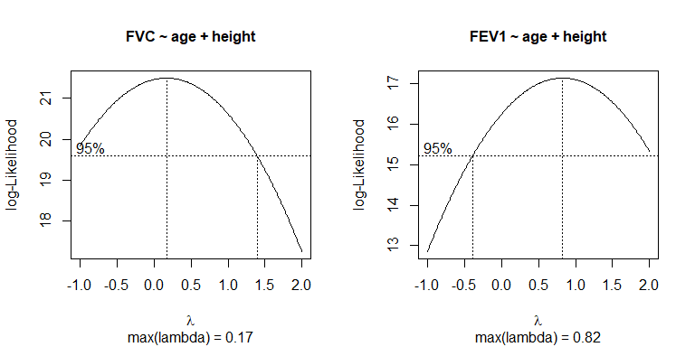<!-- -->

```r
par(mfrow=c(1,1))
```

The Box-Cox transformation suggests using $\lambda=0.17$ for the FVC regression and $\lambda=0.82$ for the FEV1 regression, these are the values when the MLE takes the maximum. Let's build the models with the transformation.


```r
lm_FVC_bc = lm(data = data2, formula = FVC^0.17 ~ age + height)
summary(lm_FVC_bc)
```

```
## 
## Call:
## lm(formula = FVC^0.17 ~ age + height, data = data2)
## 
## Residuals:
##      Min       1Q   Median       3Q      Max 
## -0.11707 -0.03052 -0.00977  0.03019  0.10909 
## 
## Coefficients:
##               Estimate Std. Error t value Pr(>|t|)    
## (Intercept)  1.9392772  0.1680670  11.539  < 2e-16 ***
## age         -0.0023568  0.0006129  -3.845 0.000276 ***
## height       0.0060202  0.0009089   6.624 7.98e-09 ***
## ---
## Signif. codes:  0 '***' 0.001 '**' 0.01 '*' 0.05 '.' 0.1 ' ' 1
## 
## Residual standard error: 0.04498 on 65 degrees of freedom
## Multiple R-squared:  0.5584,	Adjusted R-squared:  0.5448 
## F-statistic:  41.1 on 2 and 65 DF,  p-value: 2.904e-12
```


```r
lm <- lm_FVC_bc
print(sprintf('Diagnostic Plots for %s', as.character(formula(lm))))
```

```
## [1] "Diagnostic Plots for ~"            "Diagnostic Plots for FVC^0.17"    
## [3] "Diagnostic Plots for age + height"
```

```r
autoplot(lm, which = 1:6, ncol = 3, label.size = 3)
```

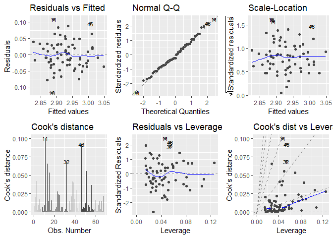<!-- -->


```r
lm_FEV1_bc = lm(data = data2, formula = FEV1^0.82 ~ age + height)
summary(lm_FEV1_bc)
```

```
## 
## Call:
## lm(formula = FEV1^0.82 ~ age + height, data = data2)
## 
## Residuals:
##      Min       1Q   Median       3Q      Max 
## -26.7510  -9.3602  -0.1753   7.4948  26.6589 
## 
## Coefficients:
##             Estimate Std. Error t value Pr(>|t|)    
## (Intercept) -50.3789    44.8430  -1.123    0.265    
## age          -0.9240     0.1635  -5.650 3.83e-07 ***
## height        1.3197     0.2425   5.442 8.59e-07 ***
## ---
## Signif. codes:  0 '***' 0.001 '**' 0.01 '*' 0.05 '.' 0.1 ' ' 1
## 
## Residual standard error: 12 on 65 degrees of freedom
## Multiple R-squared:  0.5778,	Adjusted R-squared:  0.5649 
## F-statistic: 44.49 on 2 and 65 DF,  p-value: 6.725e-13
```


```r
lm <- lm_FEV1_bc
print(sprintf('Diagnostic Plots for %s', as.character(formula(lm))))
```

```
## [1] "Diagnostic Plots for ~"            "Diagnostic Plots for FEV1^0.82"   
## [3] "Diagnostic Plots for age + height"
```

```r
autoplot(lm, which = 1:6, ncol = 3, label.size = 3)
```

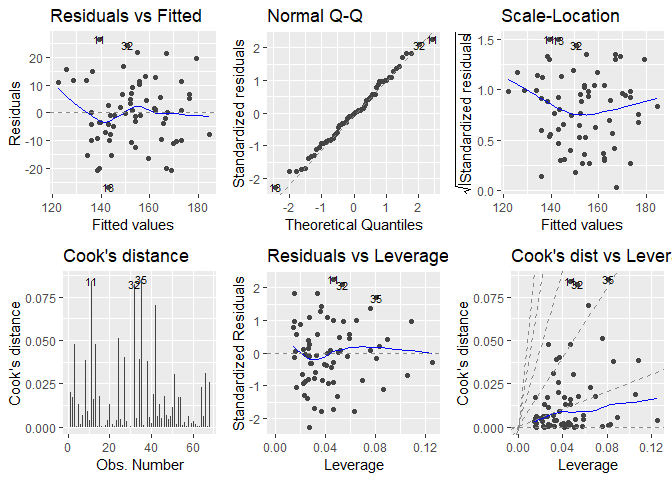<!-- -->

Conducting the test of significance of the optimal lambda's value against the values of 0, 0.5, 1, 2 for FEV1 ~ age + height.


```r
lm <- lm(data = data2, formula = FEV1 ~ age + height, model = FALSE)

bc2_lme <- boxcox(lm, lambda = bc2_lambda, plotit = FALSE)$y

bc_runs = list(lambda = c(0, 0.5, 1, 2), y = rep(NA, 4))

i <- 1
for (lambda in bc_runs[['lambda']]) {
  bc <- boxcox(lm, lambda = lambda, plotit = FALSE)
  i <- i + 1
  lrt <- -2*(bc2_lme - bc$y)
  print(sprintf('LRT Statistic for H0: boxcox(%.2f) = boxcox(%.2f): %.2f', lambda, bc2_lambda, lrt))
  # Calculate the values based on the slide 42
  bc_runs[['y']][[i]] <- bc$y
}
```

```
## [1] "LRT Statistic for H0: boxcox(0.00) = boxcox(0.82): -1.78"
## [1] "LRT Statistic for H0: boxcox(0.50) = boxcox(0.82): -0.28"
## [1] "LRT Statistic for H0: boxcox(1.00) = boxcox(0.82): -0.08"
## [1] "LRT Statistic for H0: boxcox(2.00) = boxcox(0.82): -3.62"
```

# Generalized Linear Model


```r
glm_11 <- glm(data = data2, FVC ~ age + height + weight + region, family = gaussian(link=log))
summary(glm_11)
```

```
## 
## Call:
## glm(formula = FVC ~ age + height + weight + region, family = gaussian(link = log), 
##     data = data2)
## 
## Deviance Residuals: 
##      Min        1Q    Median        3Q       Max  
## -113.128   -36.386    -5.754    30.561   121.743  
## 
## Coefficients:
##               Estimate Std. Error t value Pr(>|t|)    
## (Intercept)  4.3999315  0.3495887  12.586  < 2e-16 ***
## age         -0.0047967  0.0013080  -3.667 0.000506 ***
## height       0.0113593  0.0021095   5.385 1.14e-06 ***
## weight       0.0009856  0.0013313   0.740 0.461845    
## regionM     -0.0151434  0.0238310  -0.635 0.527436    
## ---
## Signif. codes:  0 '***' 0.001 '**' 0.01 '*' 0.05 '.' 0.1 ' ' 1
## 
## (Dispersion parameter for gaussian family taken to be 2612.759)
## 
##     Null deviance: 379625  on 67  degrees of freedom
## Residual deviance: 164604  on 63  degrees of freedom
## AIC: 734.82
## 
## Number of Fisher Scoring iterations: 4
```

```r
glm_12 <- glm(data = data2, FVC ~ age + height + weight + region, family = gaussian(link=identity))
summary(glm_12)
```

```
## 
## Call:
## glm(formula = FVC ~ age + height + weight + region, family = gaussian(link = identity), 
##     data = data2)
## 
## Deviance Residuals: 
##      Min        1Q    Median        3Q       Max  
## -114.096   -34.272    -9.496    31.847   128.731  
## 
## Coefficients:
##              Estimate Std. Error t value Pr(>|t|)    
## (Intercept) -547.7474   203.0333  -2.698 0.008945 ** 
## age           -2.6517     0.7154  -3.707 0.000445 ***
## height         6.6175     1.2407   5.334 1.39e-06 ***
## weight         0.3443     0.7624   0.452 0.653139    
## regionM       -7.2715    13.4506  -0.541 0.590685    
## ---
## Signif. codes:  0 '***' 0.001 '**' 0.01 '*' 0.05 '.' 0.1 ' ' 1
## 
## (Dispersion parameter for gaussian family taken to be 2633.86)
## 
##     Null deviance: 379625  on 67  degrees of freedom
## Residual deviance: 165933  on 63  degrees of freedom
## AIC: 735.36
## 
## Number of Fisher Scoring iterations: 2
```


```r
glm_21 = glm(data = data2, FEV1 ~ age + height + region, family = gaussian(link=log))
summary(glm_21)
```

```
## 
## Call:
## glm(formula = FEV1 ~ age + height + region, family = gaussian(link = log), 
##     data = data2)
## 
## Deviance Residuals: 
##     Min       1Q   Median       3Q      Max  
## -91.830  -33.563   -3.548   32.695  101.822  
## 
## Coefficients:
##              Estimate Std. Error t value Pr(>|t|)    
## (Intercept)  4.584244   0.344741  13.298  < 2e-16 ***
## age         -0.007578   0.001349  -5.615 4.55e-07 ***
## height       0.010091   0.001849   5.459 8.34e-07 ***
## regionM      0.011677   0.024834   0.470     0.64    
## ---
## Signif. codes:  0 '***' 0.001 '**' 0.01 '*' 0.05 '.' 0.1 ' ' 1
## 
## (Dispersion parameter for gaussian family taken to be 1949.797)
## 
##     Null deviance: 300261  on 67  degrees of freedom
## Residual deviance: 124787  on 64  degrees of freedom
## AIC: 713.99
## 
## Number of Fisher Scoring iterations: 4
```

```r
glm_22 = glm(data = data2, FEV1 ~ age + height + region, family = gaussian(link=identity))
summary(glm_22)
```

```
## 
## Call:
## glm(formula = FEV1 ~ age + height + region, family = gaussian(link = identity), 
##     data = data2)
## 
## Deviance Residuals: 
##     Min       1Q   Median       3Q      Max  
## -92.939  -31.566   -0.776   28.116   99.649  
## 
## Coefficients:
##              Estimate Std. Error t value Pr(>|t|)    
## (Intercept) -293.8672   166.3922  -1.766   0.0821 .  
## age           -3.3626     0.6118  -5.496 7.21e-07 ***
## height         4.8801     0.8975   5.437 9.04e-07 ***
## regionM        3.7198    11.5167   0.323   0.7478    
## ---
## Signif. codes:  0 '***' 0.001 '**' 0.01 '*' 0.05 '.' 0.1 ' ' 1
## 
## (Dispersion parameter for gaussian family taken to be 1972.506)
## 
##     Null deviance: 300261  on 67  degrees of freedom
## Residual deviance: 126240  on 64  degrees of freedom
## AIC: 714.77
## 
## Number of Fisher Scoring iterations: 2
```


```r
glm_23 <- glm(data = data2, FEV1 ~ age + height + region, family = Gamma(link=log))
summary(glm_23)
```

```
## 
## Call:
## glm(formula = FEV1 ~ age + height + region, family = Gamma(link = log), 
##     data = data2)
## 
## Deviance Residuals: 
##       Min         1Q     Median         3Q        Max  
## -0.238466  -0.070486  -0.003386   0.065118   0.223449  
## 
## Coefficients:
##              Estimate Std. Error t value Pr(>|t|)    
## (Intercept)  4.531691   0.366778  12.355  < 2e-16 ***
## age         -0.007293   0.001349  -5.408 1.01e-06 ***
## height       0.010357   0.001978   5.235 1.96e-06 ***
## regionM      0.006284   0.025386   0.248    0.805    
## ---
## Signif. codes:  0 '***' 0.001 '**' 0.01 '*' 0.05 '.' 0.1 ' ' 1
## 
## (Dispersion parameter for Gamma family taken to be 0.009584274)
## 
##     Null deviance: 1.4235  on 67  degrees of freedom
## Residual deviance: 0.6166  on 64  degrees of freedom
## AIC: 716.31
## 
## Number of Fisher Scoring iterations: 4
```


```r
anova(glm_23, test="F")
```

```
## Analysis of Deviance Table
## 
## Model: Gamma, link: log
## 
## Response: FEV1
## 
## Terms added sequentially (first to last)
## 
## 
##        Df Deviance Resid. Df Resid. Dev       F    Pr(>F)    
## NULL                      67    1.42345                      
## age     1  0.54511        66    0.87835 56.8752 2.074e-10 ***
## height  1  0.26116        65    0.61719 27.2490 2.069e-06 ***
## region  1  0.00058        64    0.61660  0.0609    0.8059    
## ---
## Signif. codes:  0 '***' 0.001 '**' 0.01 '*' 0.05 '.' 0.1 ' ' 1
```


```r
lm <- glm_23
print(sprintf('Diagnostic Plots for %s', as.character(formula(lm))))
```

```
## [1] "Diagnostic Plots for ~"                    
## [2] "Diagnostic Plots for FEV1"                 
## [3] "Diagnostic Plots for age + height + region"
```

```r
autoplot(lm, which = 1:6, ncol = 3, label.size = 3)
```

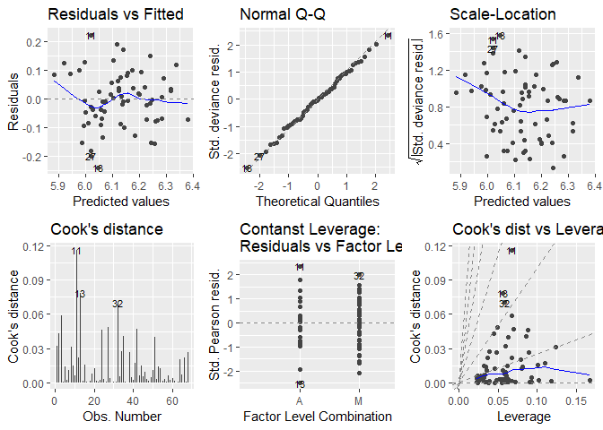


```r
data2['regionM'] <- data2['region'] == 'M'
glm_24 <- glm(data = data2, regionM ~ FEV1 + age + height + weight, family = binomial(link=logit))
summary(glm_24)
```

```
## 
## Call:
## glm(formula = regionM ~ FEV1 + age + height + weight, family = binomial(link = logit), 
##     data = data2)
## 
## Deviance Residuals: 
##     Min       1Q   Median       3Q      Max  
## -1.9181  -1.2859   0.7703   0.9169   1.2983  
## 
## Coefficients:
##              Estimate Std. Error z value Pr(>|z|)
## (Intercept)  7.476727   9.247674   0.808    0.419
## FEV1         0.002669   0.006084   0.439    0.661
## age         -0.034001   0.036182  -0.940    0.347
## height      -0.058427   0.065155  -0.897    0.370
## weight       0.043721   0.035409   1.235    0.217
## 
## (Dispersion parameter for binomial family taken to be 1)
## 
##     Null deviance: 87.021  on 67  degrees of freedom
## Residual deviance: 83.703  on 63  degrees of freedom
## AIC: 93.703
## 
## Number of Fisher Scoring iterations: 4
```


```r
pred_2 <- function(age) {
  res <- exp(predict(glm_23, newdata = data.frame('age' = age, 'height' = 180, 'weight' = 80, region = 'M')))
  return(res)
}

ages <- seq(17, 56)
FEV1_pred <- lapply(ages, pred_2)

plot(ages, FEV1_pred)
```

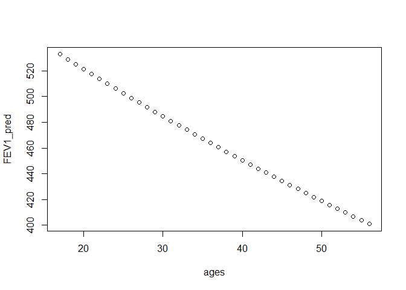<!-- -->

# Ideas

1. Regress on the volume of body rather than on just the height and/or the weight because the logic suggests that the lung function depends on the volume of body rather than only on the latter two. A quick check on Google reveals there are works how to calculate the volume using the two dimensions e.g. Sendroy Jr, Julius, and Harold A. Collison. "Determination of human body volume from height and weight." Journal of Applied Physiology 21, no. 1 (1966): 167-172.
