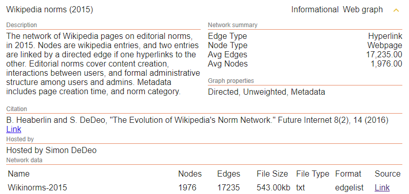
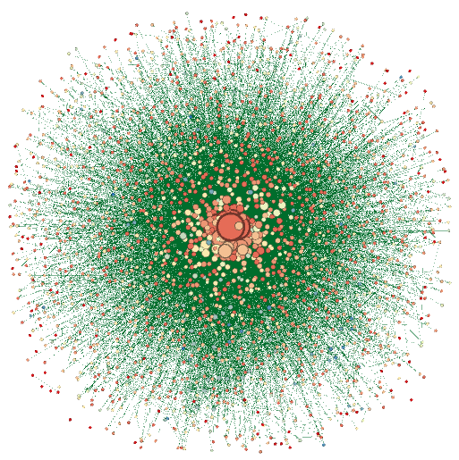

```{r setup, include=FALSE}
knitr::opts_chunk$set(echo = TRUE)
rm(list = ls())                             # Remove all the objects we created so far.
```

# Project Description

The network chosen for the project is described at the [ICON](https://icon.colorado.edu/#!/networks) as follows:

image: 

The network data is kept at the [link](http://tuvalu.santafe.edu/~simon/styled-9/styled-10/)

# Data Transformation

The network's data is originally provided in its own format in three CVS files:
1. **nodes.csv** - a tab-delimited file containing node properties: id's, names and other attributes.
2. **links.csv** - a comma-delimited file, containing an information about links
3. **topics.csv** - a comma-delimited file, containing the topic distribution for the page in question.

The content of **topics.csv** is ignored for the time being as it contains additional information not required for the project.

The network data was read and transformed to two formats (gml and Pajek) with the **01_transform.R** auxiliary script.

```{r, echo=F, message=FALSE}
library(igraph)
net <- read_graph("wiki_norms.gml", format = "gml")
```

# Basic Network Characteristics 

The nodes represent web pages, each page describes some Wikipedia social norm. 
The links are the HTTP reference from one page to another.

It's a directed graph by its nature, no weights assigned to the links.

|Property              | Value |
|:---------------------|:-----------------|
| Vertices, number     | `r length(V(net))`                                   |
| Arcs, number         | `r length(E(net))`                                   |
| Average degree       | `r round(2*length(E(net))/length(V(net)), 1)`        |
| Diameter             | `r diameter(net, directed = TRUE, weights = NULL)`   |
| Acyclic?             | `r is.dag(net)`                                      |

Interestig to note there are isolated nodes, their percentage is

```{r, echo=F}
round(100*mean(degree(net, mode = "all") == 0), 1)
```

## Top 20 Nodes

The first 20 nodes with the largest number of degree. The high number of 
total degree for a node is provided by incoming links. Which makes sense as it's rare
to see a page with a lot of outgoing links but it's rather common for a popular
page to get a lot of references to it.

```{r, echo=F}
# Degree

net_deg_all <- degree(net, mode = "all")
net_deg_in  <- degree(net, mode = "in")
net_deg_out <- degree(net, mode = "out")

print(sprintf("%-36s %-10s %10s %10s %16s", "Page Name", "Type", "In-degree", "Out-degree", "Total Degree"), quote = F)
print("-----------------------------------------------------------------------------------------", quote = F)
for (node_id in order(net_deg_all, decreasing = T)[1:20]) {
  print(sprintf("%-36s %-10s %10d %10d %16d", 
    V(net)$PageName[node_id],
    V(net)$Type[node_id],
    net_deg_in [[node_id]],
    net_deg_out[[node_id]],
    net_deg_all[[node_id]]), 
    quote = F)
}
```

## Components

## Density

The proportion of present edges from all possible edges in the network.
```{r, echo=F}
# for undirected network
# edge_density(net, loops=F)

# for directed network
ecount(net)/(vcount(net)*(vcount(net)-1))
```

The nodes along the first found path of the diameter distance.
```{r}
V(net)$PageName[get.diameter(net)]
```

# Degree

The top nodes in terms of degree were listed previously.

The degree distribution (in-degree, out-degree, total)

```{r}
# Degree
net_deg_in  <- degree(net, mode = "in")
net_deg_out <- degree(net, mode = "out")
net_deg_all <- degree(net, mode = "all")

par(mfrow = c(1,3))
hist(net_deg_in,  breaks = 20, freq = T, main = "", xlab = "Degree (In)")
hist(net_deg_out, breaks = 20, freq = T, main = "", xlab = "Degree (Out)")
hist(net_deg_all, breaks = 20, freq = T, main = "", xlab = "Degree (All)")
```

```{r, echo = F}
net_deg_dist_all <- degree_distribution(net, cumulative=T, mode="all")
net_deg_dist_in  <- degree_distribution(net, cumulative=T, mode="in")
net_deg_dist_out <- degree_distribution(net, cumulative=T, mode="out")

par(mfrow=c(3,1))

plot(x = 0:max(degree(net, mode="all")), 
     y = 1 - net_deg_dist_all, 
     pch = 19, 
     cex = 1.2, 
     col = "orange", 
     xlab = "Degree (All)", 
     ylab = "Cumulative Frequency")

plot(x = 0:max(degree(net, mode="in")), 
     y = 1 - net_deg_dist_in, 
     pch=19, 
     cex=1.2, 
     col  = "orange", 
     xlab = "Degree (In)", 
     ylab = "Cumulative Frequency")

plot(x = 0:max(degree(net, mode="Out")), 
     y = 1 - net_deg_dist_out, 
     pch = 19, 
     cex = 1.2, 
     col = "orange", 
     xlab = "Degree (Out)", 
     ylab = "Cumulative Frequency")
```

# Nodes

The nodes, as previously said, are pages describing social norms of Wikipedia. 
The measurement of importance of nodes depends on a research question. 
For example, if we are interested in mostly referenced pages or mostly edited pages.

From the editorial point of view that's probably the mostly linked page is mostly 
important i.e. the importance is measured by the number of in-degree. And, 
the largest nodes in terms of that were previously listed.

<!--

Let's create a heatmap of nodes with more than 200 in-degree links.

```{r}
netm <- get.adjacency(net, sparse = F) # , attr="weight", sparse=F)

colnames(netm) <- V(net)$media
rownames(netm) <- V(net)$media

palf <- colorRampPalette(c("white", "dark orange")) 

heatmap(netm[,10:1], Rowv = NA, Colv = NA, col = palf(10), 
        scale="none", margins=c(10,10) )
```
-->

# Betweenness

```{r}
net_bt = betweenness(net, v = V(net), directed = TRUE)
hist(net_bt, breaks = 30, freq = T, main = "", xlab = "Betweenness")

# net_eb <- cluster_edge_betweenness(net, directed = TRUE)
# plot_dendrogram(net_eb)
```


# Subnetworks

In trying to determine subnetworks we find there are a hundrend of one node networks (isolated nodes)
and one large subnetwork of 1872 nodes. That's shown on the histogram below where x is ln of the size 
of each of those networks

```{r, eval=T, echo=F}
net_dec <- decompose.graph(net)
net_sn_len <- c()
for (i in 1:length(net_dec)) { 
  net_sn_len <- c(net_sn_len, length(V(net_dec[[i]]))) 
}
hist(log(net_sn_len, 10), breaks = 5, xlab = "ln(<number of nodes>")
```

# Communities

TBC

<!--
-- Check it for comminuties detection: http://kateto.net/networks-r-igraph

Community detection (betweenness), up to 10 communities

```{r, eval=F}
net_eb <- edge.betweenness.community(net)

membership <- cut_at(net_eb, no = 10)
plot(net,
  vertex.color= rainbow(10, .8, .8, alpha=.8)[membership],
  vertex.size=5, layout=layout,  vertex.label=NA,
  edge.arrow.size=.2)
```


```{r, eval=F}
betweenness(net)
edge.betweenness(net)

plot(net, layout=layout,
  vertex.size = map(betweenness(net),c(1,15)),
  edge.width = map(edge.betweenness(net), c(1,10)))
```
-->

# Visualization

Visualization was made in Gephi with manual configuration. An effort of doing 
the same with igraph provides suboptimal results of nodes and edges overlapping 
each other.

The size of nodes reflects the number of degrees for that node. The color of 
node reflects which community it belong to.

The visualization demonstrates the network is centered around several large nodes.

image: 

The visualization also saved as wiki_norms_vis.pdf


<!--

```{r, eval=F, echo=F}
pdf("wiki_norms.pdf")

plot(net, layout = layout.auto, vertex.size = 2, edge.arrow.size=.2, vertex.label = NA)

dev.off()
```

```{r, eval=F, echo=F}
V(net)$size <- log2(degree(net, mode = "in"))

pdf("wiki_norms_top_nodes.pdf")

net_tn <- induced_subgraph(net, degree(net, mode = "in") >= 200)

plot(net_tn, 
     layout = layout.fruchterman.reingold, 
     edge.arrow.size=.2, 
     vertex.label=V(net_tn)$PageName,
     vertex.shape="none",
     vertex.label.font=2, 
     vertex.label.color="red",
     vertex.label.cex=.7)     

dev.off()
```

-->

# Ideas to Improve Report

1. Take into account the network was already analyzed for communites. Draw some
   conclusions from it.
2. Provide statistics on betweenness, closeness.
3. Dendrogram? Will it work for such a large network?
4. Try the hierarchical clustering.
5. Provide more interpretaion of the network.

# Appendix A Technical Details of Report

This version of the report was built with:

```{r}
devtools::session_info()
```
